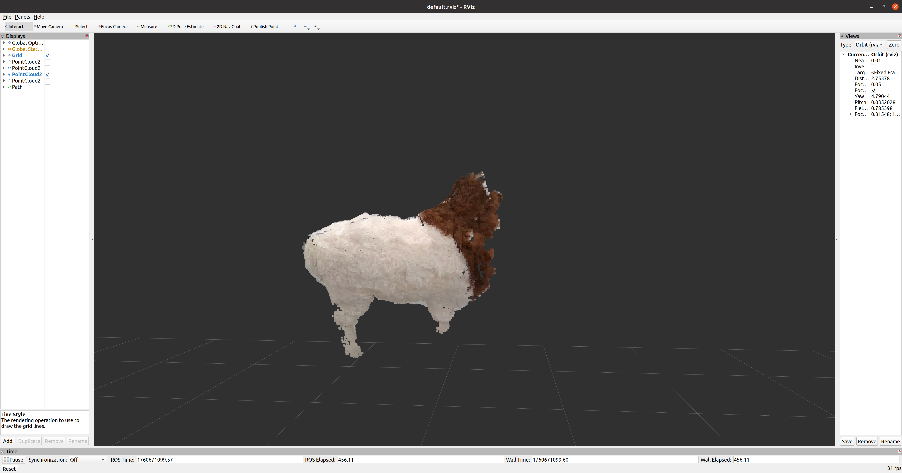
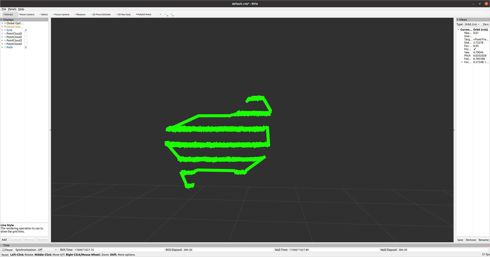
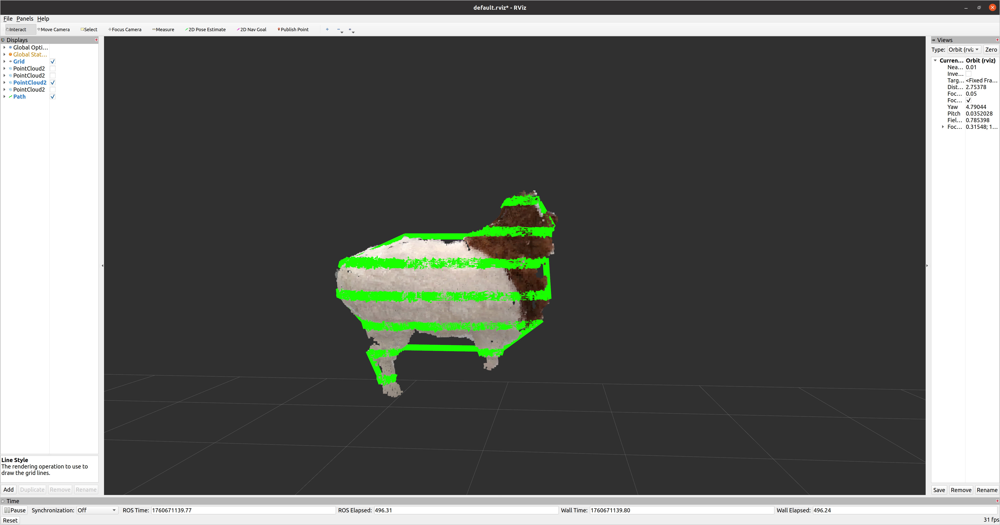
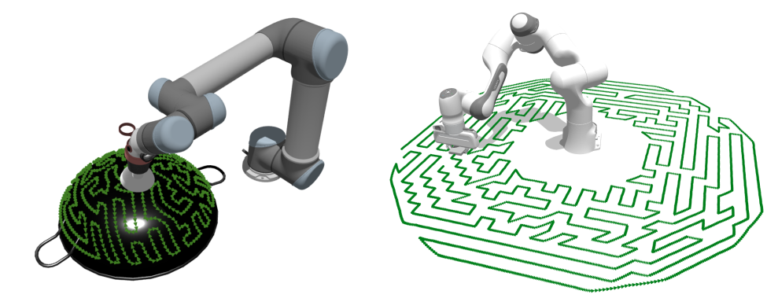

# README.md

## 一、点云切片算法学习与应用

### 数学原理

#### 1.平面方程

给定参数 `parameterA, parameterB, parameterD`，构造常量
$$
A = \text{parameterA}, \quad B = \text{parameterB}, \quad C = 0, \quad D = -\text{parameterD}
$$

平面方程为
$$
\Pi: \quad A x + B y + C z + D = 0
$$

固定切片平面 y=0.5 时
$$
A = 0, \quad B = 1, \quad C = 0, \quad D = -0.5
$$

#### 2.点到平面的距离

点 p=(x,y,z) 到平面 Π 的距离
$$
\text{dist}(p, \Pi) = \frac{|A x + B y + C z + D|}{\sqrt{A^2 + B^2 + C^2}}
$$

判断点是否位于平面附近
$$
\text{dist}(p, \Pi) \le \varepsilon
$$

#### 3.将附近点分为两侧

代入平面方程计算符号
$$
s(p) = A x + B y + C z + D
$$

#### 4.最近邻互配

互配判定条件
$$
\| p_i - p_i' \| < 10^{-6}
$$

欧氏距离公式
$$
\| p - q \| = \sqrt{(x_p - x_q)^2 + (y_p - y_q)^2 + (z_p - z_q)^2}
$$

#### 5.求线段与平面交点

线段参数化
$$
\ell(t) = p_1 + t (p_2 - p_1), \quad t \in \mathbb{R}
$$

代入平面方程求 t
$$
A(x_1 + t (x_2 - x_1)) + B(y_1 + t (y_2 - y_1)) + C(z_1 + t (z_2 - z_1)) + D = 0
$$

解得
$$
t = - \frac{A x_1 + B y_1 + C z_1 + D}{A (x_2 - x_1) + B (y_2 - y_1) + C (z_2 - z_1)}
$$

交点坐标
$$
\text{inter} = p_1 + t (p_2 - p_1)
$$

### 点云切片算法应用

沿 Z轴方向从上到下切成带状层，每条带内的点按 X轴坐标从左到右排列，相邻层之间按 S 蛇形顺序，即：

- 第一层：X 从左到右
- 第二层：X 从右到左
- 第三层：X 从左到右
- … 依次交替

## 二、机械臂末端全覆盖路径规划相关论文

 [Hierarchically Accelerated Coverage Path Planning for Redundant Manipulators.pdf](pdf\Hierarchically Accelerated Coverage Path Planning for Redundant Manipulators.pdf) （2025 ICRA)

三种方法比较：

1. **Cart-TSP-IKLink（方法1）**：在笛卡尔空间构造图、解 TSP，再用 IKLink（路径跟踪）把笛卡尔路经映射到关节轨迹。效率高但关节目标未被直接优化。
2. **Joint-GTSP（方法2）**：为每个表面点随机采样多个 IK 解，构造关节空间的 GTSP，然后求解。能直接在关节空间优化，但图规模为 n×m（n 为点数，m 为每点的 IK 数），计算成本高且不易扩展。
3. **H-Joint-GTSP（作者方法，层级加速）**：先从表面抽取“代表点（exemplars）”并为这些代表点采样 IK，解上层小规模 GTSP 得到若干“guide path”（引导路径）；再沿引导路径向邻近非代表点传播 IK 解，构造下层较小 GTSP 并求解最终关节路径。这样把大问题拆成一系列小问题，显著减小图规模并加速求解，同时保持关节空间目标。

